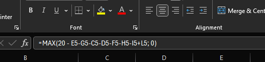

# How to use

## 1. Creating the exec file
cd into project folder and paste command
`pyinstaller --onefile --windowed timer.py`

## 2. Schedule
### Edit Goal Hours
Click on K5, K6 or K7.
At the top bar you should change the first integer(20 in image) to the number of hours you want to study that course for.

### Reset Week
Will reset everything in the table

### Failed Prev
If you for some reason don't have time to reach your goal, this would be the place to write down missed hours.

## 3. Editing Timer (Optional)
To change any color, check the method **Styles** starting at line 57.
Changing colors and fonts should be straight forward, just play around with the different
Background colors, font types etc.

If you for some reasons need more than 12 intervalls (If you do, your a machine), Then check the **newIntervall** Method at line 128.
The first **if-statement** should be one more than what you want on the first line.
In my code I want 4 intervalls to show on each line, so my code is <5.
On the second change the statement in the same way, but also change the value 4 inside **new_label.grid(column=self.i-4)** to the number of intervalls you want displayed.
Do the same for the last one, but use number of itnervalls x2 instead.

You might need to also change the root.geometry on the first line in **appSetup** to fit your new intervalls. 
